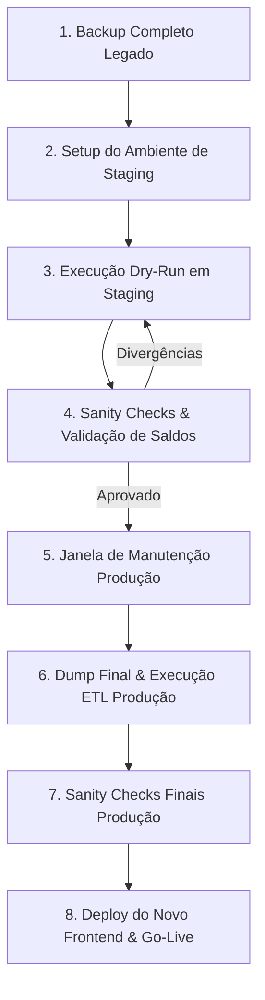

# DATA_MIGRATION_GUIDE.md — Guia de Migração de Dados (FinançasAPP → FinançasNew)

> **Status:** v1.0 — Guia operacional e técnico para migração segura de dados entre a versão legada (`FinançasAPP`) e o novo ecossistema refatorado (`FinançasNew`).
> **Ambiente:** Supabase (PostgreSQL 15+) · Node.js / TypeScript · Service Role.
> **Idioma:** pt-BR.

---

## 1. VISÃO GERAL E OBJETIVO

Este documento define o processo passo a passo para extrair, transformar e carregar (**ETL**) com segurança todos os dados do banco de dados do **FinançasAPP** (legado) para a nova estrutura do **FinançasNew**.

### Diferenças Arquiteturais Relevantes:
1. **Regras de Negócio e Atomicidade:** O novo sistema possui validações severas de integridade (datas $\ge 2026-01-01$, invariantes de parcelamento, vínculo obrigatório de cartões).
2. **Unificação de Categorias:** Despesas e receitas agora compartilham a tabela `categories` diferenciadas pelo campo `type ('expense' | 'income')` e existe uma categoria reservada de `"Estorno"`.
3. **Dívidas e Cartões:** Dívidas usam `paid_at` (timestamptz anulável) em vez de coluna de texto `status`, e pagamentos de cartão suportam sinalização explícita de estorno (`is_refund = true`).
4. **Carteira de Investimentos:** Apenas ativos, transações históricas e metas de alocação (rebalanceamento) são migrados; módulos legados pesados (tiers quantamentais, consultoria multi-cliente, scuttlebutt) foram descontinuados (§6 do `AGENTS.md`).

---

## 2. MAPEAMENTO DE ENTIDADES (SCHEMA MAPPING)

| Entidade | Tabela Legada (`financasapp`) | Tabela Nova (`financasnew`) | Regras de Transformação e Decisões |
|---|---|---|---|
| **Usuários & Auth** | `auth.users`, `public.profiles` | `auth.users`, `public.profiles`, `public.user_preferences` | Preservar o mesmo `id` (`UUID`) de `auth.users`. Mapear `full_name` $\rightarrow$ `name`. Criar registro em `user_preferences` com configurações padrão. |
| **Categorias de Despesa** | `public.categories` | `public.categories` | `type = 'expense'`, `is_reserved = false`, `is_active = true`. Preservar `id` (`UUID`). |
| **Categorias de Receita** | `public.income_categories` | `public.categories` | `type = 'income'`, `is_reserved = false`, `is_active = true`. Preservar `id` (`UUID`). |
| **Categoria Reservada** | *(Não existia)* | `public.categories` | Criar `"Estorno"` (`type = 'income'`, `is_reserved = true`) para cada usuário. |
| **Cartões de Crédito** | `public.credit_cards` | `public.credit_cards` | `limit_total` $\rightarrow$ `credit_limit`. Preservar `id`, `closing_day`, `due_day`, `color`, `is_active`. |
| **Ciclos de Fatura** | `public.credit_card_monthly_cycles` | `public.card_competence_overrides` | `credit_card_id` $\rightarrow$ `card_id`, `competence` $\rightarrow$ `month` (formato `YYYY-MM`). |
| **Pagamentos de Fatura** | `public.credit_card_bill_payments` | `public.card_payments` | `payment_date` $\rightarrow$ `date`, `bill_competence` $\rightarrow$ `competence_month`. Se nota contiver `[REFUND]` ou `amount < 0`, marcar `is_refund = true` e `amount = abs(amount)`. |
| **Despesas** | `public.expenses` | `public.expenses` | `amount` $\rightarrow$ `value`. `credit_card_id` $\rightarrow$ `card_id`. `installment_total` $\rightarrow$ `installments_total` (default 1). Se `installments_total > 1`, gerar `installment_group_id` UUID se nulo. Calcular obrigatoriamente `base_amount = round(value / coalesce(report_weight, 1.0), 2)`. |
| **Receitas** | `public.incomes` | `public.incomes` | `amount` $\rightarrow$ `value`. `income_category_id` $\rightarrow$ `category_id`. Se vinculado a estorno, preencher `source_ref`. |
| **Dívidas** | `public.debts` | `public.debts` | Se `status = 'paid'`, preencher `paid_at = due_date::timestamptz`; se `'pending'`, `paid_at = NULL`. Propagar `installment_group_id` se parcelada. |
| **Orçamentos (Limites)** | `public.expense_category_month_limits` | `public.budgets` | `limit_amount` $\rightarrow$ `"limit"`, `month` mantido. |
| **Metas de Renda** | `public.income_category_month_expectations` | `public.income_goals` | `expectation_amount` $\rightarrow$ `expected`, `income_category_id` $\rightarrow$ `category_id`. |
| **Ativos da Carteira** | `public.portfolio_assets` / `portfolio_asset_definitions` | `public.portfolio_assets` | Extrair ativos do portfólio pessoal (`client_id = user_id`). Preservar `ticker`, `currency`. |
| **Transações da Carteira** | `public.portfolio_transactions` | `public.portfolio_transactions` | Mapear operações para `asset_id` correspondente. Validar tipos de operação (`buy`, `sell`, `dividend`, etc.). |
| **Metas de Alocação** | `public.target_allocations` / `portfolio_group_targets` | `public.allocation_targets`, `public.class_targets`, `public.sector_targets` | Mapear percentuais de ativos para `allocation_targets` e metas de classe/setor para `class_targets`/`sector_targets`. |

---

## 3. REGRAS CRÍTICAS E TRATAMENTO DE INVARIANTES

> [!IMPORTANT]
> **Data de Corte (`APP_START_DATE = 2026-01-01`):**
> O novo banco de dados impõe constraints severas (`CHECK (date >= date '2026-01-01')`).
> Caso existam transações legadas anteriores a 2026-01-01, você deve escolher entre:
> - **Opção A (Recomendada):** Migrar apenas dados analíticos a partir de 2026-01-01, consolidando saldos anteriores em um lançamento de abertura em 2026-01.
> - **Opção B:** Ajustar a data de registros históricos para `2026-01-01` com uma observação no campo `description`.

### 1. Invariante de Parcelamento
No novo schema:
```sql
CHECK ((installments_total > 1) = (installment_group_id IS NOT NULL))
```
- Lançamentos à vista: `installments_total = 1`, `installment_number = 1`, `installment_group_id = NULL`.
- Lançamentos parcelados: `installments_total > 1`, `installment_number` entre $1$ e `installments_total`, `installment_group_id` **obrigatoriamente preenchido com UUID**.
- Se o legado possuir parcelas sem `installment_group_id`, o ETL agrupará por `(user_id, description, installments_total, category_id)` e gerará um UUID consistente.

### 2. Campo Obrigatório `base_amount`
No novo schema, `base_amount numeric(12,2) NOT NULL`:
- Se `report_weight = 1.0` (ou nulo): `base_amount = value`.
- Se `report_weight < 1.0`: `base_amount = round(value / report_weight, 2)`.

### 3. Estornos de Cartão
No legado, estornos podiam ser gravados como valores negativos em pagamentos de fatura.
- No `FinançasNew`, gravam-se em `card_payments` com `is_refund = true` e `amount = abs(amount)`.
- É criada a receita correspondente na categoria reservada `"Estorno"` com `source_ref = '[REFUND]...'`.

---

## 4. ROTEIRO DE TRANSIÇÃO SEGURA (PASSO A PASSO)

Para garantir **zero perda de dados**, **idempotência** e **capacidade de rollback**, siga este checklist:



### Passo 1: Backup Completo dos Bancos
Antes de qualquer comando, gere um dump completo dos dois bancos de dados:
```bash
# Dump do banco de dados legado
pg_dump -h db.legacy-project.supabase.co -U postgres -d postgres -F c -b -v -f backup_legacy_$(date +%Y%m%d_%H%M%S).dump

# Dump de segurança do banco de dados novo (caso já contenha dados)
pg_dump -h db.new-project.supabase.co -U postgres -d postgres -F c -b -v -f backup_new_$(date +%Y%m%d_%H%M%S).dump
```

### Passo 2: Configuração das Credenciais do ETL
Crie um arquivo `.env.migration` no diretório raiz do projeto novo:
```env
# Supabase Legado (Origem)
LEGACY_SUPABASE_URL="https://seu-legado.supabase.co"
LEGACY_SUPABASE_SERVICE_ROLE_KEY="eyJhbGciOi..."

# Supabase Novo (Destino)
NEW_SUPABASE_URL="https://seu-novo.supabase.co"
NEW_SUPABASE_SERVICE_ROLE_KEY="eyJhbGciOi..."

# Configurações do Processo
MIGRATION_START_DATE="2026-01-01"
DRY_RUN="false"
```

> [!CAUTION]
> Use **SEMPRE** a `SUPABASE_SERVICE_ROLE_KEY` e **NUNCA** a chave anônima (`anon_key`). O Service Role permite desativar restrições de RLS temporárias durante a carga e processar múltiplos usuários de forma atômica.

### Passo 3: Execução em Ambiente de Staging / Local
1. Rode o script em modo de teste (`DRY_RUN=true` ou apontando para um banco local/staging).
2. Verifique os logs de transformação linha a linha.
3. Garanta que nenhum erro de constraint (`CHECK`, `FOREIGN KEY`, `NOT NULL`) ocorra.

### Passo 4: Execução dos Sanity Checks SQL
Execute o script de validação SQL (§6 deste guia) e compare as somas de receitas, despesas, faturas e dívidas entre o banco legado e o novo.

### Passo 5: Janela de Manutenção e Go-Live
1. Notifique os usuários e ative a tela de manutenção no app legado.
2. Execute a migração final apontando para o banco de produção.
3. Rode a bateria de Sanity Checks.
4. Efetue o deploy do novo frontend (`FinançasNew`) na Vercel/Cloudflare.

---

## 5. SCRIPT EXECUTÁVEL DE MIGRAÇÃO (`scripts/migrate-legacy-data.mjs`)

O script executável é `scripts/migrate-legacy-data.mjs` (Node ESM, sem build — usa `@supabase/supabase-js`). Abaixo está a versão de referência em TypeScript do mesmo fluxo, para consulta/manutenção. Ele utiliza `upsert` idempotente por registro para garantir alta performance e repetibilidade.

```typescript
import { createClient } from '@supabase/supabase-js'
import dotenv from 'dotenv'
import { v4 as uuidv4 } from 'uuid'

dotenv.config({ path: '.env.migration' })

const legacyUrl = process.env.LEGACY_SUPABASE_URL!
const legacyKey = process.env.LEGACY_SUPABASE_SERVICE_ROLE_KEY!
const newUrl = process.env.NEW_SUPABASE_URL!
const newKey = process.env.NEW_SUPABASE_SERVICE_ROLE_KEY!
const startDate = process.env.MIGRATION_START_DATE || '2026-01-01'

if (!legacyUrl || !legacyKey || !newUrl || !newKey) {
  console.error('ERRO: Variaveis de ambiente LEGACY_* e NEW_* sao obrigatorias.')
  process.exit(1)
}

const legacyClient = createClient(legacyUrl, legacyKey)
const newClient = createClient(newUrl, newKey)

async function runMigration() {
  console.log('--- INICIANDO MIGRACAO DE DADOS: FINANCASAPP -> FINANCASNEW ---')

  // 1. USUARIOS & PROFILES
  console.log('\n[1/8] Migrando Perfis e Preferencias...')
  const { data: legacyProfiles, error: profErr } = await legacyClient
    .from('profiles')
    .select('*')

  if (profErr) throw profErr

  for (const prof of legacyProfiles || []) {
    const { error: pErr } = await newClient.from('profiles').upsert({
      id: prof.id,
      name: prof.full_name || prof.email?.split('@')[0] || 'Usuario',
      email: prof.email,
      created_at: prof.created_at || new Date().toISOString(),
    })
    if (pErr) console.error(`Erro ao salvar profile ${prof.id}:`, pErr.message)

    const { error: prefErr } = await newClient.from('user_preferences').upsert({
      user_id: prof.id,
      theme: 'dark',
      reminders_enabled: true,
      reminder_days_before_debt: 3,
      reminder_days_before_bill: 3,
      report_weights_enabled: true,
      max_sector_acoes: 30,
      max_sector_fiis: 30,
    })
    if (prefErr) console.error(`Erro ao salvar preferences ${prof.id}:`, prefErr.message)
  }

  // 2. CATEGORIAS (DESPESAS E RECEITAS)
  console.log('\n[2/8] Migrando Categorias (Unificacao + Estorno)...')
  const { data: expCats } = await legacyClient.from('categories').select('*')
  const { data: incCats } = await legacyClient.from('income_categories').select('*')

  const unifiedCategories = [
    ...(expCats || []).map((c) => ({
      id: c.id,
      user_id: c.user_id,
      type: 'expense',
      name: c.name,
      icon: c.icon || 'tag',
      color: c.color || '#64748b',
      is_reserved: false,
      is_active: true,
      created_at: c.created_at,
    })),
    ...(incCats || []).map((c) => ({
      id: c.id,
      user_id: c.user_id,
      type: 'income',
      name: c.name,
      icon: c.icon || 'wallet',
      color: c.color || '#10b981',
      is_reserved: false,
      is_active: true,
      created_at: c.created_at,
    })),
  ]

  for (const cat of unifiedCategories) {
    await newClient.from('categories').upsert(cat)
  }

  // Criar categoria reservada 'Estorno' para cada usuario
  for (const prof of legacyProfiles || []) {
    await newClient.from('categories').upsert(
      {
        user_id: prof.id,
        type: 'income',
        name: 'Estorno',
        icon: 'rotate-ccw',
        color: '#38bdf8',
        is_reserved: true,
        is_active: true,
      },
      { onConflict: 'user_id,type,name' }
    )
  }

  // 3. CARTOES DE CREDITO E CICLOS
  console.log('\n[3/8] Migrando Cartoes de Credito e Ciclos...')
  const { data: cards } = await legacyClient.from('credit_cards').select('*')
  for (const card of cards || []) {
    await newClient.from('credit_cards').upsert({
      id: card.id,
      user_id: card.user_id,
      name: card.name,
      brand: card.brand || null,
      credit_limit: Number(card.limit_total || card.credit_limit || 0),
      closing_day: Number(card.closing_day || 1),
      due_day: Number(card.due_day || 10),
      color: card.color || '#6366f1',
      is_active: card.is_active ?? true,
      created_at: card.created_at,
    })
  }

  const { data: cycles } = await legacyClient.from('credit_card_monthly_cycles').select('*')
  for (const cycle of cycles || []) {
    await newClient.from('card_competence_overrides').upsert({
      id: cycle.id,
      card_id: cycle.credit_card_id,
      month: cycle.competence,
      closing_day: Number(cycle.closing_day),
      due_day: Number(cycle.due_day),
      created_at: cycle.created_at,
    })
  }

  // 4. PAGAMENTOS DE FATURA (CARD PAYMENTS)
  console.log('\n[4/8] Migrando Pagamentos de Fatura...')
  const { data: cardPayments } = await legacyClient.from('credit_card_bill_payments').select('*')
  for (const p of cardPayments || []) {
    if (p.payment_date < startDate) continue
    const isRefund = p.amount < 0 || String(p.note || '').includes('[REFUND]')
    await newClient.from('card_payments').upsert({
      id: p.id,
      user_id: p.user_id,
      card_id: p.credit_card_id,
      competence_month: p.bill_competence,
      amount: Math.abs(Number(p.amount || 0)),
      date: p.payment_date,
      note: p.note || null,
      is_refund: isRefund,
      created_at: p.created_at,
    })
  }

  // 5. DESPESAS (EXPENSES)
  console.log('\n[5/8] Migrando Despesas e Ajustando Invariantes...')
  const { data: expenses } = await legacyClient
    .from('expenses')
    .select('*')
    .gte('date', startDate)

  for (const e of expenses || []) {
    const val = Number(e.amount || 0)
    const weight = e.report_weight !== null && e.report_weight !== undefined ? Number(e.report_weight) : 1.0
    const baseAmt = weight > 0 ? Number((val / weight).toFixed(2)) : val
    const totalInst = Number(e.installment_total || 1)
    const numInst = Number(e.installment_number || 1)
    let groupId = e.installment_group_id

    if (totalInst > 1 && !groupId) {
      groupId = uuidv4()
    } else if (totalInst <= 1) {
      groupId = null
    }

    await newClient.from('expenses').upsert({
      id: e.id,
      user_id: e.user_id,
      value: val,
      date: e.date,
      category_id: e.category_id,
      payment_method: e.payment_method || (e.credit_card_id ? 'credit_card' : 'cash'),
      card_id: e.credit_card_id || null,
      installments_total: totalInst,
      installment_number: numInst,
      installment_group_id: groupId,
      bill_competence: e.bill_competence || null,
      report_weight: weight,
      base_amount: baseAmt,
      description: e.description || null,
      created_at: e.created_at,
    })
  }

  // 6. RECEITAS (INCOMES)
  console.log('\n[6/8] Migrando Receitas...')
  const { data: incomes } = await legacyClient
    .from('incomes')
    .select('*')
    .gte('date', startDate)

  for (const inc of incomes || []) {
    const val = Number(inc.amount || 0)
    const weight = inc.report_weight !== null && inc.report_weight !== undefined ? Number(inc.report_weight) : 1.0
    await newClient.from('incomes').upsert({
      id: inc.id,
      user_id: inc.user_id,
      value: val,
      date: inc.date,
      category_id: inc.income_category_id,
      receive_type: inc.type || 'other',
      description: inc.description || null,
      report_weight: weight,
      created_at: inc.created_at,
    })
  }

  // 7. DIVIDAS (DEBTS)
  console.log('\n[7/8] Migrando Dividas...')
  const { data: debts } = await legacyClient.from('debts').select('*')
  for (const d of debts || []) {
    const isPaid = d.status === 'paid'
    await newClient.from('debts').upsert({
      id: d.id,
      user_id: d.user_id,
      name: d.name,
      type: d.type,
      amount: Number(d.amount || 0),
      due_date: d.due_date,
      paid_at: isPaid ? (d.due_date ? `${d.due_date}T12:00:00Z` : d.created_at) : null,
      expense_id: d.expense_id || null,
      installment_group_id: null,
      created_at: d.created_at,
    })
  }

  // 8. ORCAMENTOS E METAS
  console.log('\n[8/8] Migrando Orcamentos e Metas...')
  const { data: limits } = await legacyClient.from('expense_category_month_limits').select('*')
  for (const l of limits || []) {
    if (!l.limit_amount || Number(l.limit_amount) <= 0) continue
    await newClient.from('budgets').upsert(
      {
        id: l.id,
        user_id: l.user_id,
        category_id: l.category_id,
        month: l.month,
        limit: Number(l.limit_amount),
        created_at: l.created_at,
      },
      { onConflict: 'category_id,month' }
    )
  }

  const { data: expectations } = await legacyClient.from('income_category_month_expectations').select('*')
  for (const exp of expectations || []) {
    if (!exp.expectation_amount || Number(exp.expectation_amount) <= 0) continue
    await newClient.from('income_goals').upsert(
      {
        id: exp.id,
        user_id: exp.user_id,
        category_id: exp.income_category_id,
        month: exp.month,
        expected: Number(exp.expectation_amount),
        created_at: exp.created_at,
      },
      { onConflict: 'category_id,month' }
    )
  }

  console.log('\n--- MIGRACAO CONCLUIDA COM SUCESSO! ---')
}

runMigration().catch((err) => {
  console.error('\nFALHA CRITICA NA MIGRACAO:', err)
  process.exit(1)
})
```

---

## 6. SANITY CHECKS E SCRIPTS DE CONFERÊNCIA SQL

Execute estas consultas SQL no **SQL Editor do Supabase** de ambos os bancos para validar o batimento contábil:

### 1. Comparativo de Despesas por Competência/Mês
```sql
-- Executar no Novo Banco:
SELECT 
  to_char(date, 'YYYY-MM') AS mes,
  count(*) AS total_lancamentos,
  sum(value) AS total_despesas,
  sum(base_amount) AS total_base
FROM public.expenses
GROUP BY to_char(date, 'YYYY-MM')
ORDER BY mes DESC;
```

### 2. Validação de Invariante de Grupos de Parcelas
```sql
-- Deve retornar 0 linhas (nenhuma inconsistência de soma ou contagem):
SELECT 
  installment_group_id,
  count(*) AS parcelas_migradas,
  max(installments_total) AS total_esperado,
  sum(value) AS valor_somado
FROM public.expenses
WHERE installment_group_id IS NOT NULL
GROUP BY installment_group_id
HAVING count(*) <> max(installments_total);
```

### 3. Batimento de Faturas e Pagamentos de Cartão
```sql
SELECT 
  card_id,
  competence_month,
  is_refund,
  count(*) AS total_pagamentos,
  sum(amount) AS valor_pago
FROM public.card_payments
GROUP BY card_id, competence_month, is_refund
ORDER BY competence_month DESC;
```

### 4. Validação de Dívidas (Pendentes vs Pagas)
```sql
SELECT 
  type,
  (paid_at IS NOT NULL) AS quitada,
  count(*) AS quantidade,
  sum(amount) AS total_valor
FROM public.debts
GROUP BY type, (paid_at IS NOT NULL);
```

---

## 7. PLANO DE ROLLBACK E CONTINGÊNCIA

Se for identificada qualquer anomalia crítica durante a homologação:

1. **Reversão Imediata do Frontend:**
   - No painel da Vercel/Cloudflare, reverta o deploy para a versão estável anterior apontando para o banco antigo.
2. **Isolamento do Banco Novo:**
   - Como o banco de dados legado foi mantido em modo leitura/backup durante a janela, nenhuma informação do sistema antigo foi perdida ou modificada.
3. **Limpeza do Banco Novo para Nova Carga:**
   - Execute o script de limpeza em cascata caso deseje reiniciar a carga:
   ```sql
   TRUNCATE TABLE 
     public.card_payments,
     public.expenses,
     public.incomes,
     public.debts,
     public.budgets,
     public.income_goals,
     public.card_competence_overrides,
     public.allocation_targets,
     public.portfolio_transactions,
     public.portfolio_assets,
     public.credit_cards,
     public.categories,
     public.user_preferences,
     public.profiles
   CASCADE;
   ```
4. **Correção do Script e Nova Execução:**
   - Ajuste os mapeamentos no script `scripts/migrate-legacy-data.mjs` e reexecute.
