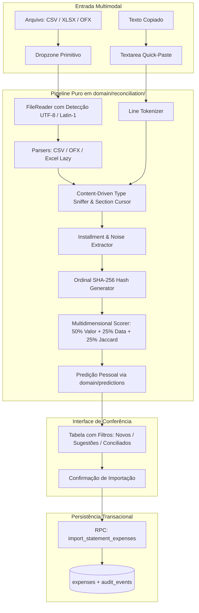

# 💳 STATEMENT_RECONCILIATION_PLAN.md — Módulo de Reconciliação e Importação Inteligente

> **Status:** Especificação Técnica Canônica & Arquitetura Refinada (Fase 30).  
> **Escopo:** Importação multi-formato (CSV, XLSX/XLS sob demanda, OFX SGML/XML e Quick-Paste), motor de parsing adaptativo sem cabeçalho, deduplicação ordinal, predição de categorias e persistência transacional idempotente.  
> **Conformidade de Governança:** `AGENTS.md` (DRY estrito, zero emojis, pureza em `domain/`) · `ARCHITECTURE.md` · `DESIGN_SYSTEM.md`.

---

## 1. OBJETIVOS E PRINCÍPIOS DE DESIGN

1. **Privacidade e Zero Custo (Client-Side First):** 100% do parsing, sanitização e cálculo de similaridade ocorrem no navegador do usuário.
2. **Resiliência Extrema a Layouts Caóticos:** Processa extratos limpos, com metadados institucionais no topo, sem cabeçalhos, com colunas divididas de débito/crédito, datas por seção ou texto copiado diretamente da web (*Quick-Paste*).
3. **Máximo Reuso e Zero Código Duplicado (DRY Estrito):**
   - Normalização textual e predição: reuso direto de `normalizeText`, `tokenize`, `jaccardTokens` e `predictFromHistory` de `src/domain/predictions/`.
   - Valores monetários: reuso de `parseBRLToCents` e `numberToCents` de `src/domain/money/parse.ts`.
   - Formatação e apresentação: reuso de `formatCentsAsBRL` de `src/services/masks/money.ts` e `<MoneyText />`.
   - Componentes de UI: reuso integral dos primitivos `Dropzone`, `Modal`, `Tabs`, `Checkbox`, `Badge`, `Select`, `Textarea` e ícones `lucide-react`.

---

## 2. ARQUITETURA DO PIPELINE DE RECONCILIAÇÃO



---

## 3. MOTOR PURO DE DOMÍNIO (`src/domain/reconciliation/`)

A pasta `src/domain/reconciliation/` é dividida em módulos especializados e desacoplados:

```
src/domain/reconciliation/
├── index.ts                 # Barrel com exports canônicos
├── types.ts                 # Tipos TS e Schemas de validação Zod
├── clean.ts                 # Higienização de strings e prefixos de adquirentes
├── installments.ts          # Extração de parcelas embutidas (Regex)
├── hash.ts                  # SHA-256 ordinal anti-colisão
├── scorer.ts                # Motor de similaridade e pontuação 0–100
├── parsers/
│   ├── index.ts             # Hub unificado de parsing (arquivo ou texto)
│   ├── csv-parser.ts        # Parser CSV com delimitador automático
│   ├── ofx-parser.ts        # Parser nativo de OFX bancário (SGML/XML)
│   ├── excel-parser.ts      # Parser lazy para planilhas (.xlsx / .xls)
│   ├── text-parser.ts       # Tokenizer para texto colado (Quick-Paste)
│   └── type-sniffer.ts      # Inferência de colunas por amostragem de dados
└── reconciliation.test.ts   # Bateria abrangente de testes unitários
```

### 3.1 Contratos TypeScript (`types.ts`)

```typescript
import { z } from "zod";

export interface StatementTransaction {
  id: string; // Identificador temporário para chave de UI
  index: number;
  occurrenceIndex: number;
  date: string; // YYYY-MM-DD
  rawDescription: string;
  cleanDescription: string;
  amountCents: number; // Inteiro em centavos
  isRefund: boolean; // Valor negativo ou marcador de devolução
  isPayment: boolean; // Pagamento de fatura anterior
  installment?: {
    current: number;
    total: number;
  };
  statementHash: string;
}

export type MatchStatus = "exact_match" | "probable_match" | "unmatched_new";

export interface ReconciliationItem {
  transaction: StatementTransaction;
  status: MatchStatus;
  score: number; // 0 a 100
  matchedExpenseId?: string;
  matchedExpenseDescription?: string;
  matchedExpenseDate?: string;
  matchedExpenseValueCents?: number;
  suggestedCategoryId: string;
  selectedCategoryId: string;
  selected: boolean;
}

export interface ExistingExpenseForReconciliation {
  id: string;
  date: string;
  description: string;
  valueCents: number;
  categoryId: string;
  installmentNumber: number | null;
  installmentsTotal: number | null;
}
```

---

## 4. ALGORITMOS DE RECONCILIAÇÃO E RESILIÊNCIA

### 4.1 Higienização de Nomes e Extração de Parcelas (`clean.ts` & `installments.ts`)
```typescript
import { normalizeText } from "@/domain/predictions";

/**
 * Remove ruídos bancários e isola o nome do estabelecimento.
 * Reutiliza normalizeText de predictions para evitar duplicar limpeza de diacríticos.
 */
export function cleanDescription(raw: string): string {
  return raw
    .trim()
    .replace(/^(PAG\*|MP\*|PAYPAL\*|IFOOD\*|UBER\*|DL\*|GOOGLE\*|AMZN\*|IOF\*|RECARGA\*)/i, "")
    .replace(/\s*\(\d{1,2}\/\d{1,2}\)/g, "")
    .replace(/\s*\bPARC\s*\d{1,2}\/\d{1,2}\b/gi, "")
    .replace(/\s*\b\d{1,2}\s*DE\s*\d{1,2}\b/gi, "")
    .replace(/\s*\d{1,2}\/\d{1,2}\b/g, "")
    .replace(/\s*-\s*(BR|SAO PAULO|RIO DE JANEIRO|CURITIBA|BELO HORIZONTE|BRASIL).*$/i, "")
    .replace(/\s{2,}/g, " ")
    .trim();
}

/** Extrai informações de parcelas embutidas no texto da descrição. */
export function extractInstallmentInfo(raw: string): { current: number; total: number } | undefined {
  const match = 
    /\((\d{1,2})\/(\d{1,2})\)/.exec(raw) ??
    /\bPARC(?:ELA)?\s*(\d{1,2})\s*(?:DE|\/)\s*(\d{1,2})\b/i.exec(raw) ??
    /\b(\d{1,2})\s*DE\s*(\d{1,2})\b/i.exec(raw) ??
    /\b(\d{1,2})\/(\d{1,2})\b/.exec(raw);

  if (!match) return undefined;
  const current = Number(match[1]);
  const total = Number(match[2]);
  if (current >= 1 && total >= 2 && current <= total && total <= 60) {
    return { current, total };
  }
  return undefined;
}
```

### 4.2 Hash Ordinal Anti-Colisão (`hash.ts`)
Evita colisões quando múltiplas transações idênticas ocorrem no mesmo dia:
$$\text{Hash} = \text{SHA-256}(\text{cardId} + "|" + \text{competence} + "|" + \text{date} + "|" + \text{amountCents} + "|" + \text{cleanDesc} + "|" + \text{occurrenceIndex})$$

### 4.3 Motor de Scoring e Correspondência Multidimensional (`scorer.ts`)
Reutiliza `jaccardTokens` e `tokenize` de `src/domain/predictions/`:

```typescript
import { jaccardTokens, tokenize } from "@/domain/predictions";

export function calculateMatchScore(
  statement: StatementTransaction,
  existing: ExistingExpenseForReconciliation,
): number {
  // 1. Componente Monetário (50%)
  if (statement.amountCents !== existing.valueCents) {
    return 0; // Exige exatidão de centavos para cartão
  }
  const scoreValue = 50;

  // 2. Componente Temporal (25%)
  const diffDays = Math.abs(
    (new Date(`${statement.date}T00:00:00`).getTime() - new Date(`${existing.date}T00:00:00`).getTime()) /
      (1000 * 60 * 60 * 24),
  );
  let scoreDate = 0;
  if (diffDays === 0) scoreDate = 25;
  else if (diffDays === 1) scoreDate = 20;
  else if (diffDays <= 3) scoreDate = 12;

  // 3. Componente Textual (25%)
  const tokensA = tokenize(statement.cleanDescription);
  const tokensB = tokenize(existing.description);
  const similarity = jaccardTokens(tokensA, tokensB);
  const scoreText = similarity * 25;

  return Math.round(scoreValue + scoreDate + scoreText);
}
```

---

## 5. BANCO DE DADOS E PERSISTÊNCIA (`supabase/migrations/`)

### 5.1 Migration SQL Transacional (`20260101000011_statement_import.sql`)

```sql
-- 1. Campos de rastreamento em expenses
ALTER TABLE expenses 
  ADD COLUMN IF NOT EXISTS statement_hash text,
  ADD COLUMN IF NOT EXISTS imported_from_statement boolean DEFAULT false;

-- 2. Índice único condicional para idempotência
CREATE UNIQUE INDEX IF NOT EXISTS idx_expenses_user_card_statement_hash 
  ON expenses (user_id, card_id, statement_hash) 
  WHERE statement_hash IS NOT NULL;

-- 3. RPC Transacional para importação segura em lote
CREATE OR REPLACE FUNCTION import_statement_expenses(
  p_card_id uuid,
  p_competence_month text,
  p_expenses jsonb
)
RETURNS jsonb
LANGUAGE plpgsql
SECURITY DEFINER
SET search_path = public
AS $$
DECLARE
  v_user_id uuid := auth.uid();
  v_item jsonb;
  v_inserted_count int := 0;
  v_skipped_count int := 0;
  v_expense_id uuid;
  v_date date;
  v_val numeric;
BEGIN
  IF v_user_id IS NULL THEN
    RAISE EXCEPTION 'Não autorizado';
  END IF;

  IF NOT EXISTS (SELECT 1 FROM credit_cards WHERE id = p_card_id AND user_id = v_user_id) THEN
    RAISE EXCEPTION 'Cartão não encontrado ou não pertence ao usuário.';
  END IF;

  FOR v_item IN SELECT * FROM jsonb_array_elements(p_expenses)
  LOOP
    v_date := (v_item->>'date')::date;
    v_val := (v_item->>'value')::numeric;

    IF v_date < '2026-01-01'::date THEN
      RAISE EXCEPTION 'Data de lançamento anterior a 2026-01-01: %', v_date;
    END IF;

    IF v_val <= 0 THEN
      RAISE EXCEPTION 'Valor de despesa deve ser estritamente positivo: %', v_val;
    END IF;

    INSERT INTO expenses (
      user_id,
      card_id,
      category_id,
      payment_method,
      value,
      base_amount,
      report_weight,
      date,
      bill_competence,
      description,
      installments_total,
      installment_number,
      statement_hash,
      imported_from_statement
    ) VALUES (
      v_user_id,
      p_card_id,
      (v_item->>'category_id')::uuid,
      'credit_card',
      v_val,
      v_val,
      COALESCE((v_item->>'report_weight')::numeric, 1.0),
      v_date,
      p_competence_month,
      v_item->>'description',
      COALESCE((v_item->>'installments_total')::int, 1),
      COALESCE((v_item->>'installment_number')::int, 1),
      v_item->>'statement_hash',
      true
    )
    ON CONFLICT (user_id, card_id, statement_hash) WHERE statement_hash IS NOT NULL
    DO NOTHING
    RETURNING id INTO v_expense_id;

    IF v_expense_id IS NOT NULL THEN
      v_inserted_count := v_inserted_count + 1;
    ELSE
      v_skipped_count := v_skipped_count + 1;
    END IF;
  END LOOP;

  INSERT INTO audit_events (user_id, entity_type, entity_id, action, payload)
  VALUES (
    v_user_id,
    'credit_card',
    p_card_id::text,
    'IMPORT_STATEMENT_BATCH',
    jsonb_build_object(
      'competence_month', p_competence_month,
      'inserted_count', v_inserted_count,
      'skipped_count', v_skipped_count,
      'total_received', jsonb_array_length(p_expenses)
    )
  );

  RETURN jsonb_build_object(
    'success', true,
    'inserted_count', v_inserted_count,
    'skipped_count', v_skipped_count
  );
END;
$$;
```

---

## 6. EXPERIÊNCIA DO USUÁRIO & REUSO DE COMPONENTES

O modal `StatementImportDialog` em `src/features/cards/components/statement-import-dialog.tsx` reutiliza:
- `<Tabs />`: Alterna entre as abas **"Arquivo (CSV, XLSX, OFX)"** e **"Colar Extrato"**.
- `<Dropzone />`: Captura de arquivos drag-and-drop.
- `<Textarea />`: Caixa de texto para entrada rápida copiada do internet banking.
- `<Badge />`: Indicadores de status translúcidos Obsidian Glass (`success` para conciliados, `warning` para sugestões, `info` para novos).
- `<MoneyText />`: Exibição formatada em centavos sem duplicar lógica de moeda.
- `<Select />`: Seletor de categorias integrado aos ícones `lucide-react`.
- `triggerHaptic("success")` e `playSound("success")`: Feedback sensorial na confirmação.

---

## 7. CRONOGRAMA DE EXECUÇÃO E TESTES (FASE 30)

| Etapa | Foco | Entregáveis |
|---|---|---|
| **1. Domínio Puro** | Parsing adaptativo, scoring, extração de parcelas e hash | `src/domain/reconciliation/*` + testes unitários no Vitest com extratos reais de múltiplos bancos |
| **2. Integração de Dados** | Banco e camada de RPC | Migration SQL, `src/data/rpc.ts` e hook em `src/state/` |
| **3. Interface & Modal** | Diálogo em 3 passos com suporte a Quick-Paste e predição | `src/features/cards/components/statement-import-dialog.tsx` e subcomponentes de etapa |
| **4. Conexão na Tela** | Acionamento na página de cartões | `src/features/cards/pages/cards-page.tsx`, testes axe de acessibilidade e regressão |
